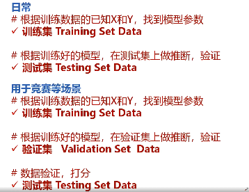
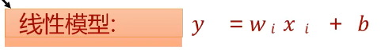
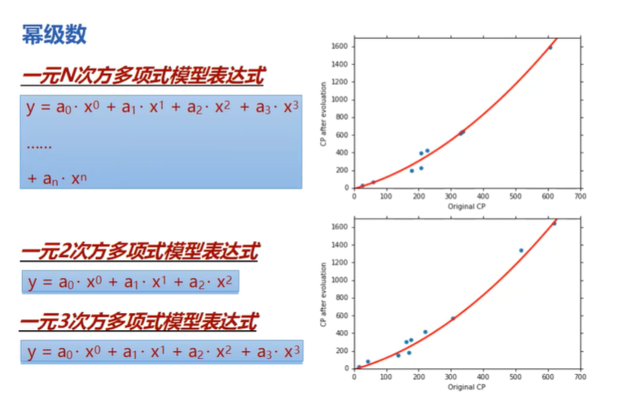

# 人工智能
人工智能就是制造智能的机器
1. 应用场景
2. 技术
3. 人工智能技术与工作结合
4. 前景
5. python基础

思维方式


什么时候用人工智能

1. 利用数据来解决简单规则无法或者难以解决的问题
2. 无法编程解决这些问题，但是可以配合数据编程来解决

# python

1. 注释是#

2. 输出该结果的类型

   print(type(a))

3. 定义一个变量

   a = 18

   a = 'Muzimin'

4. **在python中是次方的意思 

5. python的浮点数是有大小限定的

6. 复杂数据类型

   1. 列表：有序，元素可重复

      ```
      list1 = [1,2,3,3,4,5,'james','光环国际',324.2343,True]
      ```

      

   2. 元组：元素可重复

      ```py
      tuple1 = (1,2,3,3,4,5,'james','光环国际',324.2343,True)
      ```

      

   3. 集合：不可重复，无序

      ```python
      set = {1,2,3,3,4,5,'james','光环国际',324.2343,True}
      ```

      

   4. 字典：键值对形式

      ```
      dict1 = {'name':'score','James':'98'}
      ```

      

7. 循环

   1. if循环

      ```
      for i in range(10):
          print(i)
          
      list1 = [1,2,3,3,4,5,'james','光环国际',324.2343,True,{123,3543,'4546'},[23,21,56576]]
      print(list1)
      for e in list1:
          print(e)
      ```

   2. while循环

      ```
      a = 10
      while a>0:
          a -= 1
          print(a)
          print('I am learning Python')
      ```

      

8. if判断

   ```
   a = 5
   if a>4:
       print('扣一天工资')
   elif 2<a<=4:
       print('每次扣40元')
   elif 1<a<=2:
       print('每次扣20元')
   else:
       print('不扣工资')
   ```

   

9. 方法的定义

   ```
   # 用def定义，pass占位
   # 调用函数在函数后面
   
   def info(a,b,c):
       print('I am info')
       d = a+ b+c
       return d
   print(info(1,2,3),1,2,3,4,5,6)
   tuple1 = (1,2,3,3,4,5,'james','光环国际',324.2343,True)
   
   #传入可变参数
   def sum1(*num):
       add = 0
       for e in num:
           add +=  e
       return add
   print(sum1(1,2,3,94))
   ```

   

10. IO流

    ```
    #读文件
    f = open(file='file1.txt',mode='r',encoding='utf-8')
    data = f.read()
    print(data)
    f.close()
    #读文件
    with open(file='file1.txt',mode='r',encoding='utf-8') as f:
        data = f.read()
        print(data)
    
    #写文件
    f = open(file='file2.txt',mode='w',encoding='utf-8')
    f.write('光环国际\n')
    f.write('人工智能\n')
    f.write('机器学习\n')
    f.write('回归算法\n')
    ```

    

11. 异常处理

    ```
    #异常处理
    a = 4
    b = 4
    c = a +b
    d = a-b
    e = 0
    try:
        # e = c/d
        with open(file='file2.txt', mode='r', encoding='utf-8') as f:
            data = f.read()
            print(data)
    except ZeroDivisionError as z:
        print('z')
        print(z)
    except FileNotFoundError as F:
        print('F')
        print(F)
    except Exception as E:
        print('E')
        print(E)
    finally:
        print('无论是否有异常，都会执行本段代码')
    f = c ** d
    print(c)
    print(d)
    print(e)
    print(f)
    ```

    


# 人工智能的回归算法

## 回归模型以及应用场景

### 什么是回归模型：

回归模型是一种预测性的建模技术，研究的是因变量(y)和自变量(x)之间的关系，用于预测分析，时间序列模型以及发现变量之间的因果关系。有线性回归，多项式回归，逻辑回归，岭回归等

### AI算法原理：AI自己找函数


### 数据构成

#### Training Set Data

#### Testing Set Data



## 线性回归

### 什么是线性回归

利用数理用集中回归分析，来确定两种或两种以上变量关间相互依赖的定量关系的一种统计分析方法。

线性回归模型是一组函数




## 多项式回归-疫情数据分析

#### 多项式回归

回归函数是回归变量多项式的回归算法。多项式回归模型是线性回归模型的一种，此时回归函数关于回归系数是线性的。由于任一函数都可以用多项式逼近，因此多项式回归有者广泛应用。



## 特征工程

数据和特征决定了机器学习的上限，而模型和算法只是逼近这个上限而已，目的是最大限度地从原始数据中提取特征以及供算法和模型使用

一切特征都可以向量化

## 损失函数-梯度下降（数学应用）


## 模型选择

## 股票预测