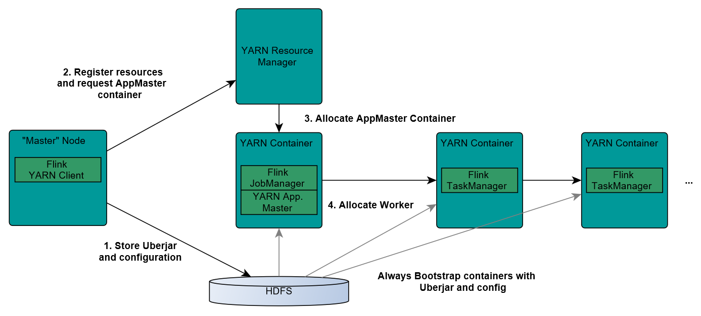
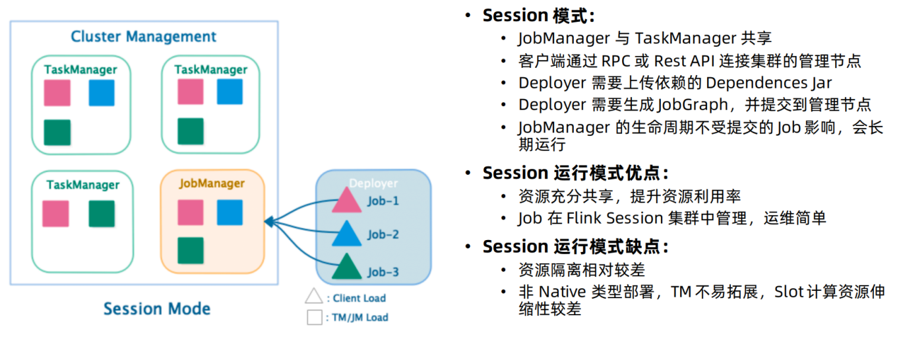
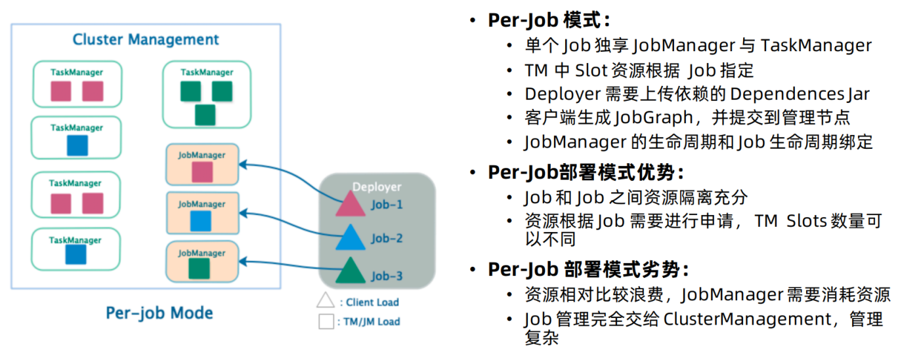

### 学习Flink的环境
 软件 | 版本  
 ---- | ----
 Linux | CentOs7
 Mysql | 8.0.21
 Java | 1.8.191
 Scala | 2.11.12
 Hadoop | 2.7.2
 hive | 3.1.2
 zookeeper | 3.5.5
 hbase | 2.1.0
 kafka | 2.3.0
### 集群IP环境
 主从 | ip | hostName | 配置
 ---- | ---- | ---- | ----
 主节点 | 192.168.147.150 | hadoop01 | 8G内存 4核 30GB硬盘
 从节点 | 192.168.147.151 | hadoop02 | 3G内存 4核 30GB硬盘
 从节点 | 192.168.147.152 | hadoop03 | 3G内存 4核 30GB硬盘
 
## Flink集群的安装模式
- Local—本地单机模式，学习测试时使用
- Standalone—独立集群模式，Flink自带集群，开发测试环境使用
- StandaloneHA—独立集群高可用模式，Flink自带集群，开发测试环境使用
- On Yarn—计算资源统一由Hadoop YARN管理，生产环境使用
    * 为什么使用On yarn模式
        * Yarn的资源可以按需使用，提高集群的资源利用率
        * Yarn的任务有优先级，根据优先级运行作业
        * 基于Yarn调度系统，能够自动化地处理各个角色的 Failover(容错)
    * Flink如何和Yarn进行交互
        
        * 又存在两种工作方式
            * **session模式**
            
            
            * **pre-job模式**
            
            
## Flink没有支持Hadoop的jar包
* 下载地址：https://flink.apache.org/downloads.html
* [jar包链接，点击获取](./lib/flink-shaded-hadoop-2-uber-2.7.5-10.0.jar)
* 将该jar包放在FLINK_HOME/lib下

## 测试example下的案例
* 进入FLINK_HOME/bin
```shell script
./flink run -m yarn-cluster -yjm 1024 -ytm 1024 ../examples/batch/WordCount.jar
```

## 查看flink run的配置参数
```shell script
./flink run --help
```
介绍一些常用的  
```shell script
-m yarn-cluster               ## 集群模式
-yqu root.hadoop.user         ## 设置队列
-yjm 1024m                    ##jobManager内存,单位MB
-ytm 2048m                    ##taskManager内存,单位MB
-ynm jobName                  ##作业的名称
-ys 2                         ##指定taskManager slot的数量
-c                            ##类名
```
执行Flink的脚本
```shell script
#!/bin/bash
export FLINK_HOME=/opt/software/flink-1.12.1
export HADOOP_CONF_DIR=/opt/software/hadoop-2.7.2/etc/hadoop/conf
export HADOOP_CLASSPATH=`hadoop classpath`
className=$1

jobName=${className##*.}
echo $jobName

$FLINK_HOME/bin/flink run \
  -m yarn-cluster \    #指定运行模式
  -yqu root.user.hive \   #指定运行队列
  -yjm 1024m \    ##jobManager内存
  -ytm 2048m \    ##taskManager内存
  -ynm $jobName \   ##设置工作名称
  -ys 2 \         ##指定taskManager slot的数量
  -c $1 \         ##类名
  /opt/software/flink-1.12.1/example/batch/WorldCount.jar
```

# 学习路线
[1.Flink入门案例](./src)