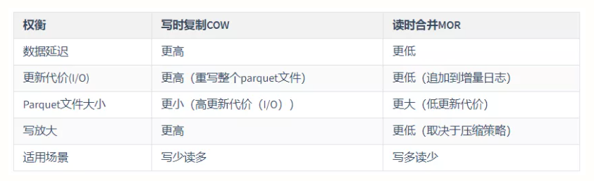

# hudi是什么？
将数据从HDFS或者S3上快速摄取的工具，支持更新和删除，同时支持增量查询。
# hudi的应用场景
1. 近实时摄取
2. 近实时分析
3. 增量处理管道
4. HDFS数据分发
# 核心概念
1. 时间轴  
hudi在所有的表中维护了一个包含在不同的即时时间对数据集操作（新增，修改或删除）的时间轴
2. 文件组织形式  
Hudi将DFS上的数据集组织到基本路径下的目录结构中。数据集分为多个分区，这些分区与Hive表非常相似，是包含该分区的数据文件的文件夹
3. 索引机制（4类6种）  
Hudi通过索引机制提供高效的Upsert操作，该机制会将一个RecordKey+PartitionPath组合的方式作为唯一标识映射到一个文件ID，而且，这个唯一标识和文件组/文件ID之间的映射自记录被写入文件组开始就不会再改变。Hudi内置了4类（6个）索引实现，均是继承自顶层的抽象类HoodieIndex而来
    * 全局索引
    * 非全局索引
4. 查询视图
    1. 读优化视图 : 直接查询基本文件（数据集的最新快照），其实就是列式文件（Parquet）。并保证与非Hudi列式数据集相比，具有相同的列式查询性能
    2. 增量视图 : 仅查询新写入数据集的文件，需要指定一个Commit/Compaction的即时时间（位于Timeline上的某个Instant）作为条件，来查询此条件之后的新数据
    3. 实时快照视图 : 查询某个增量提交操作中数据集的最新快照，会先进行动态合并最新的基本文件(Parquet)和增量文件(Avro)来提供近实时数据集（通常会存在几分钟的延迟）
# hudi支持的存储类型
1. 写时复制(copy on write)适用于读多写少的环境  
COW表主要使用列式文件格式（Parquet）存储数据，在写入数据过程中，执行同步合并，更新数据版本并重写数据文件，类似RDBMS中的B-Tree更新。  
    * 更新：在更新记录时，Hudi会先找到包含更新数据的文件，然后再使用更新值（最新的数据）重写该文件，包含其他记录的文件保持不变。当突然有大量写操作时会导致重写大量文件，从而导致极大的I/O开销。  
    * 读取：在读取数据集时，通过读取最新的数据文件来获取最新的更新，此存储类型适用于少量写入和大量读取的场景。
2. 读时合并(merge on read)适用于写多读少的环境  
MOR表是COW表的升级版，它使用列式（parquet）与行式（avro）文件混合的方式存储数据。在更新记录时，类似NoSQL中的LSM-Tree更新。  
    * 更新：在更新记录时，仅更新到增量文件（Avro）中，然后进行异步（或同步）的compaction，最后创建列式文件（parquet）的新版本。此存储类型适合频繁写的工作负载，因为新记录是以追加的模式写入增量文件中。
    * 读取：在读取数据集时，需要先将增量文件与旧文件进行合并，然后生成列式文件成功后，再进行查询。
# hudi在sparkSQL的使用
