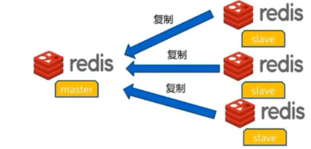
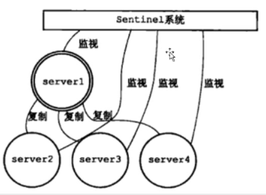
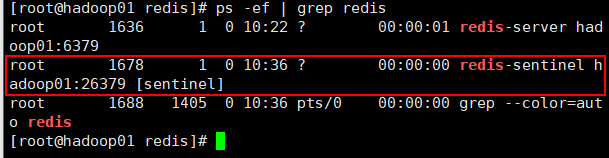
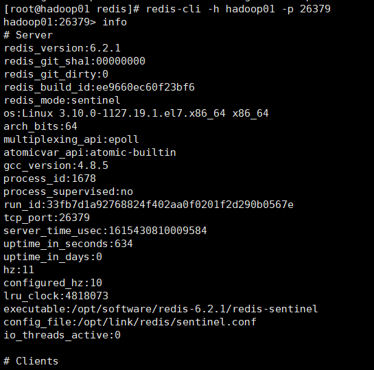
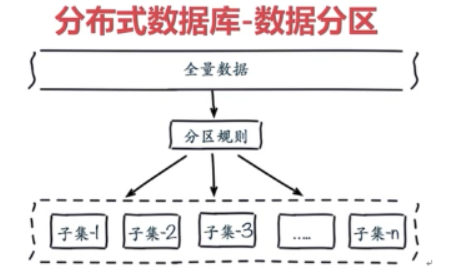
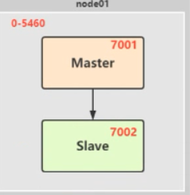

# Redis Study

## Redis的安装

* 本次使用的redis版本是6.2.1
* 将tar包上传到hadoop01这台机器的/opt/tar_lib/目录下
* tar zxvf redis-6.2.1.tar.gz -C ../software/
* 安装C程序的运行环境

```shell script
yum -y install gcc-c++
```

* 安装TCL

```shell script
yum -y install tcl
```

* 编译redis

```shell script
# 进入redis的目录下,make命令进行编译
make MALLOC=libc
make test && make install PREFIX=/opt/software/redis-6.2.1
```

* 修改Redis的配置

```shell script
# 增加两个目录在redis目录
mkdir log
mkdir data
vim redis.conf
444行 dir /opt/software/redis-6.2.1/data
292行 logfile "/opt/software/redis-6.2.1/log/redis.log"
247行 daemonize yes
75行  bind hadoop01
```

* 创建软连接和配置环境变量

```shell script
创建软连接：ln -s /opt/software/redis-6.2.1/ /opt/link/redis

在家目录下.bashrc配置环境变量vim .bashrc
####_REDIS_CONF_####
export REDIS_HOME=/opt/link/redis
export PATH=$PATH:$REDIS_HOME/bin

刷新环境变量
source .bashrc
```

* 启动redis服务

```shell script
redis-server /opt/link/redis/redis.conf
进入客户端
redis-cli -h hadoop01 -p 6379

redis-cli --raw   加上这个可以避免中文乱码
```

* 关闭redis服务

```shell script
redis-cli -h hadoop01 -p 6379 shutdown
```

## Redis的数据类型

具体命令的操作：https://www.runoob.com/redis/redis-commands.html

1. string字符串
2. list列表
   1. 简单的字符串列表，按照插入顺序排序，可以添加一个元素到列表的头部或者尾部，一个列表最多可以包含2的32次方-1个元素
3. set集合
   1. set是string类型的无序集合，集合成员是唯一的，这就意味着集合中不能出现重复的数据
   2. 集合是通过哈希表来实现，所以添加，删除，查找的复杂度都是O(1)
   3. 集合中最大的成员数为2的32次方-1个成员
4. hash表
   1. hash是一个string类型的field和value的映射表，hash特别适合用于存储对象，每个hash可以存储2的32次方-1个键值对
5. zset有序集合
   1. 有序集合是String类型元素的集合，且不允许有重复的数据
   2. 用来保存需要排序的数据，每个元素都带有权重，以此来对元素进行排序
   3. 有三个元素，key，member，score。
6. BitMaps的操作
   1. 计算机最小的存储单位是bit，BitMaps是针对位的操作，相较于String，Hash，Set等存储方式更加的节省空间
   2. BitMaps不是一种数据结构，操作是基于String结构的，一个String最大可以存储512M，那么一个BitMaps则可以设置2的32次方个位
   3. BitMaps单独提供了一套命令，所以在Redis中使用BitMaps和使用字符串的方法不太相同，可以把**BitMaps想象成一个以位为单位的数组**，数组的每个单元只能存储0和1，数组的下标在BitMaps中叫做偏移量。
   4. BitMaps的命令说明：将每个独立用户是否访问过网站存放在BitMaps中，将访问的用户记做1，没有访问的用户记做0，用偏移量作为用户的ID
   5. BitMaps的操作
      1. 设置值：SETBIT key offset value  
         setbit设置的value只能是0和1两个值，在第一次初始化BitMaps时，如果偏移量非常大，那么整个初始化过程执行会比较慢，可能会造成Redis的阻塞。
      2. 获取值：GETBIT key offset
      3. 获取BitMaps指定范围值为1的个数：BITCOUNT key \[start end]
      4. BitMaps间的运算：BITOP operation destkey key \[key,_]  
         bitop是一个复合操作，它可以做多个BitMaps的and(交集)，or(并集)，not(非),xor(异或)操作并将结果保存在destkey中        
7. HyperLogLog结构的操作
   1. 应用场景：只用来做一些去重的，大数据量的统计
   2. 限制：  
      1. 这个HyperLogLOg结构存在一定的误差，误差很小，0.81%，所以它不适合对精确度要求特别高的统计，而UV这种操作，对精确度要求没那么高，是可以适合该结构的
      2. HyperLogLog结构不会存储数据的明细，针对UV场景，他为了节省空间资源，只会存储数据结果算法计算后的基数值，基于基数进行统计的
      3. 操作：  
         pfadd key userid userid...  
         PFCOUNT key key1...

## Redis Java API

redis不仅可以通过命令行进行操作，也可以通过JavaAPI操作，通过使用Java API来对Redis数据库中各种数据类型操作

* 导入maven依赖

```xml
<dependency>
    <groupId>redis.clients</groupId>
    <artifactId>jedis</artifactId>
    <version>3.5.1</version>
</dependency>
```

* 设置连接

```java
JedisPoolConfig config = new JedisPoolConfig();
//指定最大空闲连接
config.setMaxIdle(10);
//最小空闲连接
config.setMinIdle(5);
//最大等待时间
config.setMaxWaitMillis(3000);
//最大连接数
config.setMaxTotal(50);
jedisPool = new JedisPool(config, "hadoop01", 6379);
```

* 一些简单操作

```java
Jedis jedis = jedisPool.getResource();

//获取所有key
Set<String> keys = jedis.keys("*");

jedis.set("pv", "0");
jedis.incr("pv");
jedis.incrBy("pv", 1000);
jedis.hset("goods", "iphone11", "10000");
//... API 的操作和shell命令是一致的
```

## redis的持久化

由于redis是一个内存数据库，内存当中的数据极易丢失，有两种持久化方式，RDB和AOF

#### RDB持久化方案

* redis会定期保存数据快照到一个rdb文件中，并在启动的时候会自动加载rdb文件，恢复之前的数据，在配置文件中配置redis进行快照保存的时机

```shell script
save second changes
该配置表示在seconds秒内如果发生了changes次数据修改,则进行一次RDB快照保存,例如save 60 100
```

* 可以配置多条save指令，让redis执行多级的快照保存策略，Redis默认开启RDB快照，也可以通过SAVE或者BGSAVE命令手动触发RDB快照保存

  * sava直接调用rbdSave，阻塞Reids的主进程，直到保存完成位置，在主进程阻塞期间，服务器不能处理客户端的任何请求
  * bgsave则fork出一个子进程，子进程负责调用rdbSave，并在保存完成之后向主进程发送信号，通知保存已完成，redis服务器在bgsave执行期间仍然可以继续处理客户端请求

* RDB方案的优点

  * 对性能影响最小。
  * 每次快照会生成一个完整的数据快照文件，所以可以辅以其他手段保存多个时间点的快照，作为非常可靠的灾难恢复手段
  * 使用RDB文件进行数据恢复比使用AOF要快很多

* RDB方案的缺点

  * 快照是定期生成的，所以在redis crash时或多或少会丢失一部分数据
  * 如果数据集非常大且CPU不够强，redis在fork子进程时可能会消耗相对较长的时间，影响对外提供服务的能力

* RDB配置

  * vim redis.conf

  ```
  371行 save 3600 1
  372行 save 300 100
  373行 save 60 10000
  ```

  * 修改完配置需要重启redis服务

#### AOF持久化方案

* 采用AOF持久方式时，Redis会把每一个写请求都记录在一个日志文件里，在redis重启时，会把AOF文件中记录的所有写操作顺序的执行一遍，确保数据恢复到最新

* 开启AOF

  * AOF默认时关闭的，若要开启，进行如下配置

  ```shell script
  1230行 appendonly yes
  ```

  * 配置AOF：AOF提供了三种fsync配置，通过配置项appendfsync指定
    * appendfsync no：不进行fsync，将fsync文件的时机交给OS决定，速度最快
    * appendfsync always：每写入一条日志就进行一次fsync，数据安全性最高，但是速度最慢。
    * appendfsync everysec：折中方案，交由后台线程每秒fsync一次

* AOF rewrite  
  随着AOF不断的记录写操作日志，因为所有的写操作都会记录，所以必定会出现一些无用的日志，大量无用的日志会让AOF文件过大，也会让数据恢复的时间过长，不过redis提供了AOF rewrite功能，可以重写AOF文件，只保留能够把数据恢复到最新状态的最小写操作集。  
  AOF rewrite可以通过BGREWRITEAOF命令触发，也可以配置redis.conf定期自动进行

```shell script
auto-aof-rewrite-percentage 100   # 当AOF日志大小在该基础上增长100%后，自动进行AOF rewrite
auto-aof-rewrite-min-size 64mb    # 最开始的AOF文件必须达到了64M才开始触发rewrite
```

* AOF的优点
  * 最安全
  * AOF文件不易损坏
  * AOF文件易读可修改
* AOF的缺点
  * AOF文件比RDB文件大
  * 性能消耗比RDB高
  * 数据恢复速度比RDB慢

## redis的事务

* redis事务简介  
  redis事务的本质是一组命令的集合，事务支持一次执行多个命令，一个事务中所有命令都会被序列化，在事务执行过程中，会按照顺序串行化执行队列中的命令，其他客户端提交的命令请求不会插入事务执行命令序列中  
  **redis事务就是一次性，顺序性，排他性的执行一个队列中的一系列命令**

* redis事务没有隔离级别的概念

* redis不保证原子性

* 一个事务开始到执行经历以下三个阶段

  * 开始事务 
  * 命令入队
  * 执行事务

* 事务的相关命令

  1. multi：开启事务，redis会将后续的命令逐个放入队列中，使用exec命令来原子化执行这个命令队列
  2. exec：执行事务中的所有操作命令
  3. discard：取消事务，放弃执行事务块中的所有命令
  4. watch：监视一个或多个key，如果事务在执行前，这个key被其他命令修改，则事务中断，不会执行事务中的任何命令
  5. unwatch：取消watch对所有key的监视

* 案例演示

  * 正常情况

  ```shell script
   hadoop01:6379> set k1 v1
   OK
   hadoop01:6379> set k2 v2
   OK
   hadoop01:6379> MULTI
   OK
   hadoop01:6379(TX)> set k1 11
   QUEUED
   hadoop01:6379(TX)> set k2 22
   QUEUED
   hadoop01:6379(TX)> EXEC
   1) OK
   2) OK
   hadoop01:6379> get k1
   "11"
   hadoop01:6379> get k2
   "22"
  ```

  * 事务编译时失败处理

  ```shell script
  hadoop01:6379> set k1 v1
  OK
  hadoop01:6379> set k2 v2
  OK
  hadoop01:6379> MULTI
  OK
  hadoop01:6379(TX)> set k1 11
  QUEUED
  hadoop01:6379(TX)> sets k2 22
  (error) ERR unknown command `sets`, with args beginning with: `k2`, `22`, 
  hadoop01:6379(TX)> EXEC
  (error) EXECABORT Transaction discarded because of previous errors.
  hadoop01:6379> get k1
  "v1"
  hadoop01:6379> get k2
  "v2"
  ```

  * 事务运行时异常处理

  ```shell script
   hadoop01:6379> set k1 v1
   OK
   hadoop01:6379> set k2 v2
   OK
   hadoop01:6379> MULTI
   OK
   hadoop01:6379(TX)> set k1 11
   QUEUED
   hadoop01:6379(TX)> LPUSH k2 22
   QUEUED
   hadoop01:6379(TX)> EXEC
   1) OK
   2) (error) WRONGTYPE Operation against a key holding the wrong kind of value
   hadoop01:6379> get k1
   "11"
   hadoop01:6379> get k2
   "v2"
  ```

* redis不支持事务回滚的原因  
  语法错误或者数据结构类型错误导致事务的失败，做这种简单事务只是为了保证高并发

## Redis过期策略

过期策略一般有三种

* 定时过期  
  每个设置过期时间的key都需要创建一个定时器，到过期时间就会立即清除，该策略可以立即去除过期的数据，对内存很友好，但是会占用大量的CPU资源去处理过期的数据，从而影响缓存的响应时间和吞吐量
* 惰性过期  
  只有当访问一个key时，才会判断该key是否已过期，过期则去除，该策略可以最大化的节省CPU资源，却对内存非常不友好，极端情况可能出现大量的过期key没有再次被访问，从而不会被清除，占用大量内存
* 定期过期  
  每隔一定的时间，会扫描一定数量的数据库的expires字典中一定数量的key，并清除其中已过期的key，该策略时前两者的一个折中方案，通过调整定时扫描的时间间隔和每次扫描的限定耗时，可以在不同情况下使用CPU和内存资源达到最优的平衡效果

## 内存淘汰策略

redis用于缓存的内存不足时，怎么处理需要新写入且需要申请额外空间的数据  
在redis.conf中945行开始描述

```shell script
 # MAXMEMORY POLICY: how Redis will select what to remove when maxmemory
 # is reached. You can select one from the following behaviors:
 #
 # volatile-lru -> 在设置了过期时间的键空间里，移除最近最少使用的key，这种情况是redis既当缓存，又当持久化存储的时候才用
 # allkeys-lru -> 移除最近最少使用的key（推荐）
 # volatile-random -> 在设置了过期时间的键空间中，随机移除一个键
 # allkeys-random -> 直接在键空间中随机移除一个键
 # volatile-ttl -> 在设置了过期时间的键空间中，有更早过期时间的key优先移除
 # noeviction -> 不做键处理，只返回一个写操作错误，不推荐
```

## redis的主从复制架构

* 主从复制，是指将一台redis服务器的数据，复制到其他redis服务器，前者称为主节点master，后者成为从节点，数据的复制是单向的，只能由主节点到从节点，默认情况下，每台redis服务器都是主节点，且一个主节点可以有多个从节点或没有从节点，但一个从节点只能有一个主节点。

* 从节点也是可以对外进行服务的，主节点是有数据的，从节点可以通过复制主节点的数据，并随着主节点数据不断写入，从节点数据也会做同步的更新。从节点起到数据备份的作用。

#### 一主多从

* 出了一主一从模型外，redis还提供了一主多从的模型，也就是一个master可以有很多slave，也就是有了很多备份的数据剧本
* 可以做一个更加高可用的选择，例如一个master和一个slave挂掉了，还能有其他的slave数据备份  
  

#### 主从复制的原理

1. 当从数据库启动后，会像主数据库发送sync命令
2. 主数据库接收到sync命令后开始在后台保存快照（RDB持久化）并将保存快照期间接受到命令缓存起来再用
3. 快照完成后，主redis将快照文件和所有缓存的命令发送给从redis
4. 从redis接收到RDB和缓存命令时，会开始载入快照文件并执行接收到的缓存的命令
5. 每当主数据库接受到写命令时，就会将命令同步给从redis。步骤3和步骤4只在第一次初始化会执行

#### 主从复制的应用场景

##### 读写分离  

1. 通过主从复制实现读写分离，提供服务器的负载能力
2. 主redis负责写操作，从redis负责读操作
3. 只适合读多写少的场景

##### 从redis持久化

1. 在从redis中开始持久化，主redis禁用持久化
2. 从redis崩溃后重启主redis会将数据同步过来，数据不丢失
3. 主redis崩溃时，可以通过哨兵模式来解决

#### 主从复制架构的安装

1. 准备好三台服务器

   | 主机名   | IP              | 版本    |
   | -------- | --------------- | ------- |
   | hadoop01 | 192.168.147.150 | centos7 |
   | hadoop02 | 192.168.147.151 | centos7 |
   | hadoop03 | 192.168.147.152 | centos7 |

2. 将这三台配置免密登入，并在hosts里面配置好IP映射

   1. 配置免密登录
      1. 确保hone目录下没有.ssh文件：rm -r .ssh
      2. 生成一对公钥和私钥：ssh-keygen
      3. 追加：
         1. ssh-copy-id  主节点主机名
         2. ssh-copy-id  从节点主机名
   2. 在hosts做IP映射，vim /etc/hosts   
      192.168.147.150 hadoop01
      192.168.147.151 hadoop02
      192.168.147.152 hadoop03  

3. 每一台服务器按单节点先安装好

4. 在从节点的redis.conf中添加配置
   468行 replicaof hadoop01 6379

5. 验证是否安装成功，可以看到hadoop02和hadoop03机器已经将hadoop01的数据同步过来了，并且现在只能在主节点进行写操作  
   
   

## redis中的哨兵(sentine)模式

#### 哨兵的介绍

哨兵是redis高可用性解决方案，由一个或多个哨兵实例，组成的哨兵系统可以监视任意多个主服务器，以及这些主服务器属下的所有从服务器，并在被监视的主服务器进入下线状态时，自动将下线主服务器属下的某个从服务器升级为新的主服务器。  


#### 哨兵模式的安装

1. 在主从架构中修改三台机器的哨兵配置文件，vim $REDIS_HOME/sentinel.conf

   ```
    26行 daemonize yes
    36行 logfile "/opt/link/redis/log/sentinel.log"
    65行 dir /opt/link/redis/data/sentinel
    68行 sentinel monitor mymaster 192.168.147.150 6379 2
   ```

2. scp sentinel.conf hadoop02:$PWD,scp sentinel.conf hadoop03:$PWD

3. 每一台机器上vim $REDIS_HOME/sentinel.conf
   18行 bind ip地址

4. 启动哨兵模式
   redis-sentinel sentinel.conf
   在每一台机器中都有26379进程
   

5. 进入哨兵客户端
   redis-cli -h hadoop01 -p 26379
   info命令可以访问哨兵信息    
   

6. 我们模拟一下哨兵是否起作用，将hadoop01节点的redis进行kill -9 进程号操作  
   
   随后在hadoop02中进入哨兵模式，查看哨兵信息，以及切为hadoop03为主节点了  
   

#### 哨兵的开发连接

因为有了哨兵之后，哨兵能够自动进行主节点的切换，在Java代码中，为了同步实现高可用，需要用哨兵进行连接，当哨兵进行主节点切换的时候，Java代码也可以进行切换

```java
JedisPoolConfig config = new JedisPoolConfig();
//指定最大空闲连接
config.setMaxIdle(10);
//最小空闲连接
config.setMinIdle(5);
//最大等待时间
config.setMaxWaitMillis(3000);
//最大连接数
config.setMaxTotal(50);
HashSet<String> set = new HashSet<>();
set.add("hadoop01:26379");
set.add("hadoop02:26379");
set.add("hadoop03:26379");
jedisSentinelPool = new JedisSentinelPool("mymaster", set, config);
```

## redis集群

1. 主从复制不能实现高可用
2. 主从复制中单机的QPS(单位时间内的吞吐量)无法满足业务需求
3. 单纯向单节点添加内存，会造成GC压力过大。
4. 对于redis内存数据库来说，全量数据，单机redis节点无法满足要求，按照分区规则把数据分成若干个子集当中。  
   
5. 常见的分布方式  
   1. 顺序分布：关系型数据库设计
   2. 哈希分布
      1. 节点取余分区，类似mapreduce的分区策略，
         当分区数据量变化的时候，会导致key产生较大影响，原先分布在一个节点的数据，分区数量调整后，会到其他的分区
      2. 一致性哈希分区
         * 是一个环状的hash空间，他的分区算法和哈希取余算法不一样的
         * 当节点发生变化时，key在hash空间中距离自己最近的分区，放入该分区中
         * 分区数量变化，key的影响不大
      3. 虚拟槽分区
         * redis集群使用槽的方式来进行分区的
         * CRC16(key值)&16353 的结果来决定key在哪个槽中，16343是一个槽的大小

#### redis集群的设计

redis分布式架构，有多个节点，每个节点负责进行数据的写操作，每个节点之间会进行通信，redis集群采用无中心结构，每个节点保存数据和整个集群状态，每个节点和其他所有节点连接  


结构特点：
* 所有的redis节点彼此互联(ping-pong机制)，内部使用二进制协议优化传输速度和带宽
* 节点的fail是通过集群中超过半数的节点检查失效时才会失效
* 客户端和redis节点直连，不需要之间proxy层，客户端不需要连接集群所有节点，连接集群中任何一个可用节点即可
* redis-cluster把所有物理节点映射到\[0-16383]slot上，不一定平均分配，集群负责维护node<->slot<->value
* redis集群预分好16383个slot，当需要在redis集群中放置一个key-value时，根据CRC16(key) & 16383的值决定将一个key放入哪个slot  

redis集群的优势
* 缓存永不宕机
* 迅速恢复数据
* 集群内存看成一个整体，增大内存
* redis的网络带宽随着计算机和网卡的增加而成倍增加
* 没有中心节点，不会因为某个节点成为整个集群的性能瓶颈
* 异步处理数据，实现快速读写
* 提供了完整的数据分片，复制机制，集群具备感知准备的能力，failover解决方案

#### redis集群的搭建
集群至少有奇数个节点,我们通过三台机器搭建三主三从  


1. 修改配置文件  
   每台机器上启动2个redis服务，一个主节点服务：7001，一个从节点服务：7002
   
   
2. 在redis的安装目录下创建7001和7002目录，分别存储redis服务配置文件，日志文件和数据文件
   ```shell script
   cd /opt/link/redis
   mkdir 7001 7002
   ```
3. redis.conf配置文件拷贝至7001目录，并命名为redis_7001.conf
    ```shell script
    cp redis.conf 7001/redis_7001.conf
    ```
4. 编辑配置文件
    ```
    第75行 bind 0.0.0.0
    第94行 protected-mode no
    第98行 port 7001
    第247行 daemonize yes
    第279行 pidfile "/var/run/redis_7001.pid"
    第292行 logfile "/opt/software/redis-6.2.1/7001/log/redis.log"
    第444行 dir "/opt/software/redis-6.2.1/7001/data/"
    第1230行 appendonly yes
    第1371行 cluster-config-file nodes-7001.conf
    第1377行 cluster-node-timeout 15000
    第1363行 cluster-enabled yes
    若之前搭建了主从复制模式，需要将
    #replicaof 192.168.147.152 6379 这个给注释
    ```
5. 在7001目录下创建log，data目录
    ```shell script
    [root@hadoop01 7001]# mkdir log data
    ```
6. 配置7002端口号启动redis服务
    ```shell script
    [root@hadoop01 redis]# cp 7001/redis_7001.conf 7002/redis_7002.conf
    [root@hadoop01 redis]# vim 7002/redis_7002.conf
    #在vim中进行全局替换
    :%s/7001/7002/g

    #创建目录
    [root@hadoop01 redis]# mkdir 7002/log 7002/data
    ```
7. 将hadoop01中的redis发送到各个节点中
    ```shell script
    [root@hadoop01 software]# cd /opt/software
    [root@hadoop01 software]# scp -r redis-6.2.1 root@hadoop02:$PWD
    ```
8. 启动redis服务
    * 在三台机器上分别启动六个服务
    ```shell script
    redis-server /opt/link/redis/7001/redis_7001.conf
    redis-server /opt/link/redis/7002/redis_7002.conf
    ```
    * 选择一台机器执行如下命令，创建集群
    ```shell script
    [root@hadoop01 software]# redis-cli --cluster create 192.168.147.150:7001 192.168.147.150:7002 192.168.147.151:7001 192.168.147.151:7002 192.168.147.152:7001 192.168.147.152:7002
    ```
    * 会出现如下日志：
    
9. 测试集群，在任意一台机器上使用redis-cli客户端命令来连接redis服务
    ```shell script
    redis-cli -c -p 7001
    进入后输入cluster nodes可以查看集群信息，输入info replication查看主从信息
    ```
10. 集群管理
    * 添加新主节点：redis-cli --cluster add-node new_host:new_port existing_host:existing:port --cluster-master-id node_id
    * 添加新从节点：redis-cli --cluster add-node new_host:new_port existing_host:existing:port --cluster-slave --cluster-master-id node_id
    * hash槽重新分配，添加新节点后，需要对新添加的主节点进行hash槽重新分配，此时主节点才能存储数据，redis一共有16384个槽：redis-cli --cluster reshard host:port --cluster-from node_id --cluster-to node_id --cluster-slots <args> --cluster yes
11. javaAPI操作集群
    ```java
    private JedisCluster jedisCluster;
    
        @Before
        public void before() {
            HashSet<HostAndPort> set = new HashSet<>();
            set.add(new HostAndPort("hadoop01", 7001));
            set.add(new HostAndPort("hadoop01", 7002));
            set.add(new HostAndPort("hadoop02", 7001));
            set.add(new HostAndPort("hadoop02", 7002));
            set.add(new HostAndPort("hadoop03", 7001));
            set.add(new HostAndPort("hadoop03", 7002));
    
            //jedisPoolConfig配置对象
            JedisPoolConfig config = new JedisPoolConfig();
            //指定最大空闲连接为10个
            config.setMaxIdle(10);
            //最小空闲连接为5个
            config.setMinIdle(5);
            //最大等待时间为3000毫秒
            config.setMaxWaitMillis(3000);
            //最大连接数为50
            config.setMaxTotal(50);
    
            jedisCluster = new JedisCluster(set, config);
        }
    
        @Test
        public void test() {
            jedisCluster.set("k1", "v1");
            System.out.println(jedisCluster.get("k1"));
        }
    
        @After
        public void after() {
            jedisCluster.close();
        }
    ```

## redis问题

### redis的多数据库机制

单机下的redis有16个database，集群架构下只有一个数据库

### redis的批量操作

在生产上采用的是redis cluster集群架构，不同的key会划分到不同的slot中，因此直接使用mset或者mget等操作是行不通的

### redis集群不足的地方

有一个key的value是hash类型，如果hash对象非常大，是不支持映射到不同节点的，只能映射到集群中的一个节点上，还有就是做批量操作比较麻烦

### redis集群下如何进行批量操作

如果数据少，直接串行get操作，如果执行的key很多，就使用hashtag保证这些key映射在同一台redis节点上

### 缓存穿透

查询key，缓存和数据源中都没有，频繁查询数据源

解决缓存穿透的方案：
	1. 当查询不存在时，也将结果保存在缓存中，但是会存在另外一个问题：大量没有查询结果的请求保存在缓存中，这时需要将请求的key设置的更短一些
 	2. 提取过滤掉不合法的请求，可以使用redis的布隆过滤器

### 缓存击穿

key对应的数据存在，但是在redis中过期，此时有大量的并发请求，这些请求发现缓存过期一般都会从后端DB加载数据并回设到缓存，这个时候大量并发请求可能将后端DB压垮

解决方案：使用互斥锁

### 缓存雪崩

当服务器重启或者大量缓存集中在某一个时间段失效。这样在失效的时候，也会给后端系统DB带来很大压力

解决方案：加入缓存队列，如kafka

### 命名规范

1. 一般使用业务名或数据库名作为前缀，用冒号分隔，例如：业务名：表名：id
2. 控制key名的长度，不要使用过长的key
3. 名称中不要有特殊字符